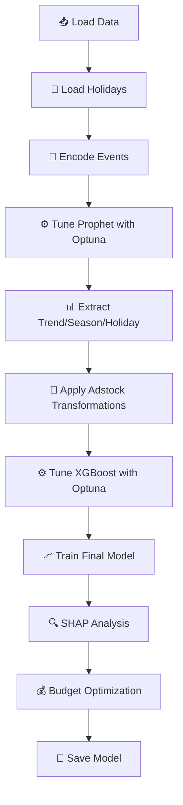

# 📊 Market Mix Modeling with XGBoost

> **A comprehensive Marketing Mix Model (MMM) leveraging Prophet for time-series decomposition and XGBoost for response modeling, with advanced adstock transformations and SHAP-based interpretability.**

[](https://colab.research.google.com/github/Praveen76/Market-Mix-Model_using_XgBoost/blob/main/MMM_using_XgBoost.ipynb)
[](LICENSE)
[](https://www.python.org/downloads/)

---

## 🎯 Project Overview

This project demonstrates an end-to-end **Marketing Mix Modeling** workflow that:

- 📈 **Quantifies** the impact of various marketing channels on sales revenue
- 🔄 **Models** carryover effects using geometric adstock transformations
- 📉 **Captures** saturation and diminishing returns through SHAP analysis
- 💰 **Optimizes** marketing budget allocation across channels
- 🎛️ **Tunes** hyperparameters using Optuna for both Prophet and XGBoost

---

## 📁 Repository Structure

```
Market-Mix-Model_using_XgBoost-main/
│
├── 📓 MMM_using_XgBoost.ipynb    # Main Jupyter notebook (1,642 lines)
├── 📊 MMM_data.csv               # Weekly marketing & sales data (208 rows)
├── 📅 prophet_holidays_daily.csv # Holiday calendar (46,194 entries)
├── 📄 README.md                  # Original project readme
├── 📜 LICENSE                    # MIT License
├── 🚫 .gitignore                 # Python gitignore template
└── 📖 my_readme.md               # This comprehensive guide
```

---

## 📊 Dataset Description

### Primary Dataset: `MMM_data.csv`

| Column | Description | Type |
|--------|-------------|------|
| `DATE` | Week ending date | datetime |
| `revenue` | Sales revenue ($K) — **Target Variable** | float |
| `tv_S` | Television advertising spend ($K) | float |
| `ooh_S` | Out-of-home advertising spend ($K) | float |
| `print_S` | Print media advertising spend ($K) | float |
| `facebook_S` | Facebook paid advertising spend ($K) | float |
| `facebook_I` | Facebook influencer marketing spend ($K) | float |
| `search_S` | Search engine marketing spend ($K) | float |
| `search_clicks_P` | Pay-per-click campaign spend ($K) | float |
| `competitor_sales_B` | Competitor sales benchmark ($K) | float |
| `newsletter` | Email newsletter marketing spend ($K) | float |
| `events` | Promotional events (`event1`, `event2`, `na`) | categorical |

**📅 Time Range:** November 2015 – November 2019 (≈208 weekly observations)

### Holiday Dataset: `prophet_holidays_daily.csv`

- **46,194** daily holiday entries across multiple countries (1995–2023)
- Filtered to **US holidays** and aggregated to weekly frequency
- Used by Prophet to capture demand shocks (Black Friday, Independence Day, etc.)

---

## 🔬 Methodology

### Phase 1: Time Series Decomposition with Prophet

```
┌─────────────────────────────────────────────────────────────┐
│                    RAW REVENUE DATA                         │
└─────────────────────────────────────────────────────────────┘
                            │
                            ▼
┌─────────────────────────────────────────────────────────────┐
│                    PROPHET MODEL                            │
│  • Yearly seasonality    • Holiday effects                  │
│  • Weekly seasonality    • Event regressors                 │
│  • Trend extraction      • Hyperparameter tuning (Optuna)   │
└─────────────────────────────────────────────────────────────┘
                            │
                            ▼
┌─────────────────────────────────────────────────────────────┐
│              EXTRACTED COMPONENTS                           │
│  📈 Trend  │  🔄 Seasonality  │  🎄 Holidays  │  🎉 Events  │
└─────────────────────────────────────────────────────────────┘
```

**Prophet Hyperparameters Tuned:**
- `seasonality_prior_scale` — Controls flexibility of seasonal patterns
- `changepoint_prior_scale` — Controls detection of trend changes
- `holidays_prior_scale` — Controls impact of holidays on forecast
- `seasonality_mode` — Additive vs multiplicative seasonality

### Phase 2: Adstock Transformation

Marketing effects don't vanish instantly—they **carry over** across weeks. The geometric adstock transformation models this decay:

$$x_{t}^{adstock} = x_t + \alpha \cdot x_{t-1}^{adstock}$$

Where:
- $x_t$ = Raw spend at time $t$
- $\alpha$ = Decay rate (0 to 1)
- Higher $\alpha$ = Longer carryover effect

**Channel-Specific Adstock Ranges:**

| Channel | α Range | Interpretation |
|---------|---------|----------------|
| TV | 0.3 – 0.8 | Long memory (brand building) |
| OOH | 0.1 – 0.4 | Medium memory |
| Print | 0.1 – 0.4 | Medium memory |
| Facebook | 0.0 – 0.4 | Short-medium memory |
| Search | 0.0 – 0.3 | Short memory (immediate response) |
| Newsletter | 0.1 – 0.4 | Medium memory |

### Phase 3: XGBoost Response Modeling

```python
Features = [
    # Prophet Components
    'trend', 'season', 'holiday', 'events',
    
    # Contextual
    'competitor_sales_B',
    
    # Media Channels (with adstock)
    'tv_S', 'ooh_S', 'print_S', 'facebook_S', 'search_S',
    
    # Organic
    'newsletter'
]
```

**XGBoost Hyperparameters Tuned via Optuna:**
- `n_estimators` (5–100)
- `max_depth` (4–7)
- `learning_rate` (0.001–0.1)
- `subsample` (0.5–1.0)
- `colsample_bytree` (0.5–1.0)
- `reg_alpha`, `reg_lambda`, `gamma` (regularization)

### Phase 4: SHAP Interpretability

SHAP (SHapley Additive exPlanations) provides:

- **Feature Importance** — Which channels drive revenue most
- **Response Curves** — Spend vs. SHAP value reveals saturation
- **Effect Share** — Contribution % per channel

---

## 📈 Key Metrics

| Metric | Formula | Purpose |
|--------|---------|---------|
| **RMSE** | $\sqrt{\frac{1}{n}\sum(y - \hat{y})^2}$ | Prediction accuracy |
| **MAPE** | $\frac{100}{n}\sum\|\frac{y - \hat{y}}{y}\|$ | Percentage error |
| **NRMSE** | $\frac{RMSE}{y_{max} - y_{min}}$ | Normalized accuracy |
| **R²** | $1 - \frac{SS_{res}}{SS_{tot}}$ | Variance explained |
| **RSSD** | $\sqrt{\sum(effect\_share - spend\_share)^2}$ | Budget efficiency |

---

## 🚀 Quick Start

### Option 1: Google Colab (Recommended)

Click the **Open in Colab** badge above and run all cells sequentially.

### Option 2: Local Installation

```bash
# Clone repository
git clone https://github.com/Praveen76/Market-Mix-Model_using_XgBoost.git
cd Market-Mix-Model_using_XgBoost

# Create virtual environment
python -m venv mmm_env
source mmm_env/bin/activate  # Windows: mmm_env\Scripts\activate

# Install dependencies
pip install pandas numpy prophet optuna shap xgboost scikit-learn
pip install seaborn matplotlib plotnine plotly

# Launch notebook
jupyter notebook MMM_using_XgBoost.ipynb
```

### Dependencies

```
pandas>=1.3.0
numpy>=1.21.0
prophet>=1.1.0
optuna>=3.0.0
shap>=0.41.0
xgboost>=1.6.0
scikit-learn>=1.0.0
seaborn>=0.11.0
matplotlib>=3.4.0
plotnine>=0.9.0
plotly>=5.0.0
```

---

## 📓 Notebook Workflow



| Step | Description | Key Output |
|------|-------------|------------|
| **Step 0** | Import libraries & load data | `df`, `holidays_weekly_us` |
| **Step 1** | Prophet hyperparameter tuning | `best_params` for Prophet |
| **Step 1.a** | Train Prophet & evaluate | MAPE, RMSE, R² on test set |
| **Step 1.b** | Extract decomposition components | `trend`, `season`, `holiday`, `events` |
| **Step 2** | Define adstock & helper functions | `AdstockGeometric` class |
| **Step 3** | XGBoost + Optuna optimization | `experiment.best_trial` |
| **Step 4** | Model refit & SHAP analysis | Feature importance, effect shares |
| **Step 5** | Multi-objective optimization | Pareto front (MAPE vs RSSD) |
| **Step 6** | Save final model | `final_xgboost_model.json` |

---

## 📊 Expected Outputs

### 1. Prophet Component Plots
- **Trend** — Long-term growth trajectory
- **Yearly Seasonality** — Annual demand patterns
- **Holiday Effects** — Spikes around major holidays
- **Event Impact** — Promotional campaign effects

### 2. Feature Importance (SHAP)
```
██████████████████████████  trend
████████████████████        tv_S
██████████████              season
████████████                facebook_S
██████████                  competitor_sales_B
████████                    search_S
██████                      ooh_S
████                        holiday
███                         print_S
██                          newsletter
█                           events
```

### 3. Spend vs Effect Share
| Channel | Spend Share | Effect Share | Efficiency |
|---------|-------------|--------------|------------|
| TV | 35% | 42% | ✅ Over-performing |
| Facebook | 25% | 28% | ✅ Efficient |
| Search | 20% | 15% | ⚠️ Under-performing |
| OOH | 12% | 10% | ⚠️ Under-performing |
| Print | 8% | 5% | ❌ Inefficient |

### 4. Response Curves
Non-linear SHAP vs. Spend curves reveal **diminishing returns** — where additional spend yields minimal incremental revenue.

---

## 💡 Business Applications

### Budget Reallocation
```
Current Allocation          Recommended Allocation
─────────────────           ─────────────────────
TV:        35% ────────────► TV:        40% (+5%)
Facebook:  25% ────────────► Facebook:  28% (+3%)
Search:    20% ────────────► Search:    15% (-5%)
OOH:       12% ────────────► OOH:       10% (-2%)
Print:      8% ────────────► Print:      7% (-1%)
```

### Scenario Simulation
- **What if** TV spend increases by 20%?
- **What if** we cut Print entirely?
- **What if** we double Search during Q4?

Apply adstock transformation → Pass through XGBoost → Project revenue impact.

---

## ⚠️ Limitations & Assumptions

| Assumption | Implication |
|------------|-------------|
| Static pricing | Revenue changes attributed to marketing, not price |
| No macro shocks | External events (COVID, recession) not modeled |
| Linear adstock decay | May oversimplify complex carryover dynamics |
| Correlation ≠ Causation | SHAP measures association, not true causal effect |
| US holidays only | Results may differ for other geographies |

---

## 🔧 Troubleshooting

| Issue | Solution |
|-------|----------|
| Prophet installation fails | Use `pip install prophet==1.1.4` or conda-forge |
| Memory error during Optuna | Reduce `n_trials` or `n_estimators` range |
| MAPE returns NaN | Check for zero revenue values; use SMAPE instead |
| SHAP feature mismatch | Ensure train/test have identical columns |
| Plotly charts not rendering | Set `pio.renderers.default = 'notebook'` |

---

## 📚 References

- [Prophet Documentation](https://facebook.github.io/prophet/)
- [XGBoost Documentation](https://xgboost.readthedocs.io/)
- [SHAP Documentation](https://shap.readthedocs.io/)
- [Optuna Documentation](https://optuna.readthedocs.io/)
- [Robyn by Meta (MMM inspiration)](https://github.com/facebookexperimental/Robyn)

---

## 📜 License

This project is licensed under the **MIT License** — see [LICENSE](LICENSE) for details.

```
MIT License

Copyright (c) 2024 Praveen Kumar Anwla

Permission is hereby granted, free of charge, to any person obtaining a copy
of this software and associated documentation files (the "Software"), to deal
in the Software without restriction...
```

---

## 👤 Credits

**Original Author:** [Praveen Kumar Anwla](https://www.linkedin.com/in/praveen-kumar-anwla-49169266/)  
**Organization:** [TowardsMachineLearning.Org](https://towardsmachinelearning.org/)

---

## 🤝 Contributing

1. Fork the repository
2. Create a feature branch (`git checkout -b feature/improvement`)
3. Commit changes (`git commit -m 'Add improvement'`)
4. Push to branch (`git push origin feature/improvement`)
5. Open a Pull Request

---

<div align="center">

**⭐ Star this repo if you find it useful!**

Made with ❤️ for Marketing Analytics

</div>
